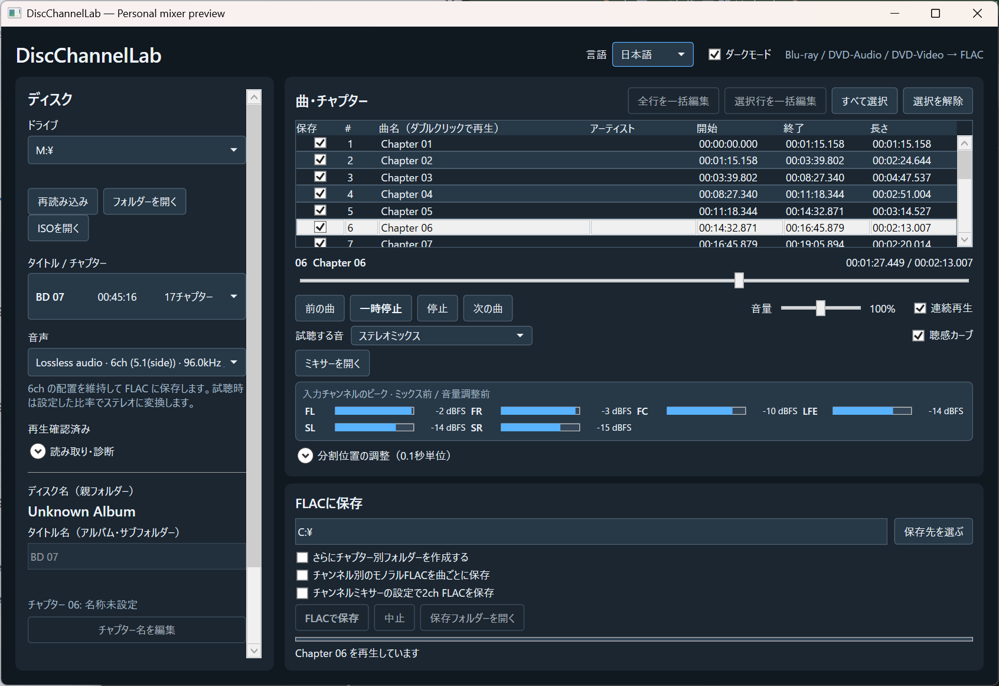
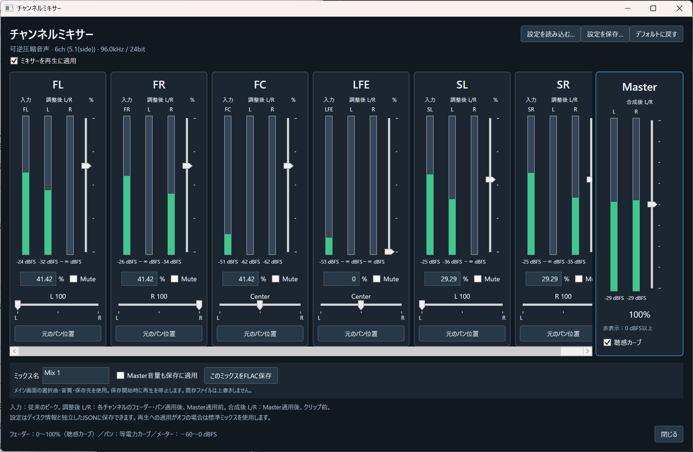

# DiscChannelLab

[English](README.md)

DiscChannelLab は、多チャンネル音声を調べるための Windows アプリです。今までブラックボックスだった 5.1ch の中身を、専門知識がなくても可視化・体感できるようにすることを目指します。チャンネルごとの試聴と FLAC 保存、比率を調整できるステレオミックスを使えます。

.NET 10 と FFmpeg を使い、保護されていない対応 Blu-ray、DVD-Audio、DVD-Video を読みます。コピー保護の解除や、特定の音声規格の独自復号機能は実装していません。音声規格の認証や提携をうたうものではありません。

## スクリーンショット

### メイン画面



### チャンネルミキサー



英語のスクリーンショット：[メイン画面](docs/screenshots/english.png) · [チャンネルミキサー](docs/screenshots/mixer-english.png)

## 主な機能

- タイトル、チャプター、曲、音声ストリーム、チャンネル配置の確認。
- 再生・一時停止、前後の曲への移動、シーク、音量調整。
- 試聴音量は聴感向けの二乗カーブが初期設定です。100% は原音、200% は 2 倍で、分析用に線形カーブへ切り替えられます。スライダーにカーソルを置くと実効ゲインと dB 値を表示します。音量変更は 10ms かけて滑らかに反映します。
- 再生中の入力チャンネルごとのピーク表示。20ミリ秒ごとに分析し、再生プレーヤーの音声時計に合わせて表示します。メーターにカーソルを置くとピークと実効レベルを dBFS で確認できます。値はミックス前・音量調整前です。
- 別窓のチャンネルミキサーに、縦型の入力・調整後ピーク、チャンネル別フェーダー、数値入力、Solo、Mute、左右パンを配置。複数のSoloを同時に再生でき、同じチャンネルではSoloとMuteが相互に解除されます。各チャンネルは0～100%、Masterは0～200%です。再生を再起動せずに調整できます。
- ミキサー設定でステレオFLACを保存。ディスクや曲情報とは独立したJSONプリセットの保存・読み込みにも対応。[ミキサーの説明](docs/channel-mixer.ja.md)を参照してください。
- 初期表示は英語・ダークモードです。右上の **Language** から日本語に切り替えられます。**Dark mode** のチェックを外すとライトモードになり、選択は次回起動時にも適用されます。
- 曲やチャプターの選択と、0.1 秒単位の分割位置調整。
- 多チャンネル FLAC、ステレオミックス、チャンネル別モノラル FLAC の保存。
- ディスク名、タイトル名、曲名、アーティスト名を表と一括編集ウィンドウで編集。タイトル名は盤とタイトルの組み合わせごとに保存します。
- FLAC は `<保存先>/<ディスク名>/<タイトル名>/<曲>.flac` に保存。各ファイルの `ALBUM` はタイトル名とし、ディスク名とチャプター番号は別のタグに記録します。追加のチャプター別フォルダーは選択式で、初期状態はオフです。
- プレイリストの終端が実際の音声よりわずかに長い場合は、クリップ末尾に最大20ミリ秒の無音を補い、指定サンプル数を維持します。それ以上の欠落はエラーにします。
- 旧 `Disc2Flac` で保存した Blu-ray の曲名・チャプター名・アルバム名を同じ盤で読み込みます。
- ドライブ、ディスクフォルダー、マウント済み ISO の読み込み。コピー保護されたソースは対象外です。

## DiscChannelLabに寄せて — Claude Sonnet

> フル5.1環境がなくても、チャンネルを1本ずつ取り出して聴くだけで「収録されているのに聴かれていない音」に気づける。

Claude SonnetによるAI生成の推薦文として、開発者から提供された文章です。[全文を読む](docs/claude-sonnet-note.ja.md) · [English translation](docs/claude-sonnet-note.md)。

<a id="5-1-downmix-level"></a>
## 5.1chを2chにすると小さく聞こえる理由

標準ミックスは、複数チャンネルを足す余裕を確保するため、固定の全体減衰を行います。ミキサーの初期値と「デフォルトに戻す」も、選択した構成の標準ミックスと一致します。安全側の初期設定であり、別途収録された2ch版との聴感音量の一致は保証しません。

5.1ch・Master 100%の場合、左右のサラウンドを `S_L` / `S_R` として、次の式を使います。

```text
a = 1/√2 ≈ 0.70710678
D = 1 + 2a ≈ 2.41421356
左出力 = (FL + a×FC + a×S_L) / D
右出力 = (FR + a×FC + a×S_R) / D
LFEの寄与 = 初期値では0
```

相対比率 `1 : 0.7071 : 0.7071` は [ITU-R BS.775-4の附属書4・表2](https://www.itu.int/dms_pubrec/itu-r/rec/bs/R-REC-BS.775-4-202212-I!!PDF-E.pdf)のステレオ化の式に対応します。さらに全体を割るのは、このアプリが採用する固定のヘッドルーム確保です。同じ最大振幅を想定した減衰の考え方は、過去の [ITU-R BS.1196（1995年版）88ページ](https://www.itu.int/dms_pubrec/itu-r/rec/bs/R-REC-BS.1196-0-199510-S!!PDF-E.pdf)にも記載されています。数学的な参考資料であり、デコーダーの規格適合を示すものではありません。[FFmpegのpanの説明](https://ffmpeg.org/ffmpeg-filters.html#pan-1)にも、係数の合計を1にする方法が示されています。

各入力の振幅の絶対値が1以下なら、三角不等式から `|左出力| ≤ (1 + a + a)/D = 1` となります。同じ瞬間に同じ向きの最大振幅が重なっても、初期設定での加算結果はフルスケール以内になります。この係数は約 `0.41421356`、同じ式で全体減衰をしない場合と比べて **約−7.66 dB** です。前方チャンネルだけに音がある区間も、この分だけ小さくなります。別マスタリングの2ch版との音量差が常に−7.66 dBになるという意味ではありません。

等電力パンを使うミキサーの表示値は次のようになります。

| 5.1chのチャンネル | 初期フェーダー | パン | 出力への寄与 |
| --- | ---: | --- | --- |
| FL / FR | 41.42% | 左 / 右 | それぞれ片側へ0.4142 |
| FC | 41.42% | 中央 | 左右それぞれへ0.2929 |
| Surround L / R | 29.29% | 左 / 右 | それぞれ片側へ0.2929 |
| LFE | 0% | 中央 | 加算しない |

表示値は丸めていますが、内部の計算精度は維持します。FL/FRを元のパン位置で手動で100%にすれば、増減なしとなりInputとPostが一致します。ほかの構成では初期係数も変わります。上記の5チャンネルの参考式が、対応する全28配置に対する普遍的な規格を意味するわけではありません。

LFEを含めないのは明示的な初期設定で、バスマネジメントは行いません。LFEにしかない情報は省略されます。実際の聞こえ方は、チャンネル間の相関・位相による打ち消し、各チャンネルの音量、元のミックスの違いにも左右されます。作品固有のダウンミックス意図の解釈や自動音量合わせは行いません。固定減衰は強弱を保ちますが、余裕が余って小さく聞こえることもあります。ピークやラウドネスを測って調整するには別の解析工程が必要で、自動では行っていません。

フェーダーの増加、LFEの追加、Masterの増幅後は、初期設定のピーク上限の保証はなくなります。リサンプリングや再構成後のトゥルーピークも、この単純なサンプル加算の証明の範囲外です。自動リミッターはありません。MasterをFLACに含めるのはチェックした場合だけです。再生へのミキサー適用はタイトル・ディスクを切り替えても保持し、オフの場合は標準ミックスを使用する旨を表示します。その場合、編集したフェーダーの値と再生係数は一致しないことがあります。

## 読み取り・診断

音声の解析に失敗しても、取得できたタイトルとチャプターは一覧に残します。タイトルには「音声なし」「対応対象外の音声」「解析失敗」などの状態を表示します。本編の選択では、時間・チャプター構成・短いクリップの繰り返し・音声の確認結果を使います。

左側の **読み取り・診断** から、選択タイトルの再解析、全タイトルの診断、診断の中止、JSONレポートの保存を行えます。チャプターは音声解析の完了前に表示し、ほかのタイトルは背後で順に確認します。再生や別の操作を始めると背後の確認を中止します。再解析では時間制限を延ばして再試行します。

Blu-rayのプレイリスト解析が失敗した場合は、構成するクリップを個別に調べます。ファイルによって音声の並び番号が変わっても、音声IDなどを照合して読み取ります。一部の区間にしかない音声にはその旨を表示し、その音声が存在しない曲を選択したまま保存することを防ぎます。

Blu-rayの末尾にある短い映像のみのクリップは、元の時間を維持して無音として再生・保存します。対象は2秒以内で、そのタイトルの末尾に1回だけ現れるクリップです。32 MB以下のファイルを全パケット検査し、解析エラーがなく、映像あり・音声ストリームなし（未対応形式の音声も存在しない）と確認できた場合に限ります。音声欄と診断レポートに無音扱いを表示します。再生・末尾へのシーク・FLAC保存で区間の長さを保ちます。未検査、解析失敗、ファイル欠落、未対応音声、長い区間や途中の欠落を無音で埋めることはなく、対象の曲は引き続き利用不可になります。映像のみの独立したタイトルは「音声なし」のままです。

**短い末尾を前の曲に含める** をオフにすると、1秒未満の末尾区間も元のチャプターとして表示します。元の境界情報は保持し、音声は削りません。補正のオン・オフで編集した区切りをそれぞれ保存し、同じ開始位置の曲名などは切り替え時に引き継ぎます。

音声の対応が曖昧な場合や、途中でチャンネル配置が変わり同じ設定では扱えない場合は、その状態を報告します。サンプリング周波数が変わる区間の再生・CD音質保存に対応し、ハイレゾ保存では各区間が保存条件を満たすか確認します。短区間のデコード確認は全編の検証を意味しません。媒体の破損、保護されたディスク、対応対象外の形式では読み取れない場合があります。

診断レポートにはタイトルの状態、元の境界と補正後の境界、クリップ情報、エラー、FFmpegのバージョンを記録します。未確認のタイトルも識別できます。ディスク情報やローカルの診断情報を含むため、共有前に内容を確認してください。

開発用の回帰テストは `dotnet run --project DiscChannelLab.Verify -c Release -- reading-tests` で実行できます。テスト音声を生成して、区切りの保持、編集情報の保存、繰り返しメニューの判定、タイムアウト・中止、音声IDの照合、周波数の変化、個別クリップ解析への切り替え、失敗タイトルの分離・再試行、音声なしの判定、FLACの正確なサンプル数を確認します。

## 動作に必要なもの

- Windows x64。
- ビルドには .NET 10 SDK、公開用ビルドの実行には .NET 10 Desktop Runtime。
- 利用者が用意した FFmpeg。変換には `ffmpeg.exe` と `ffprobe.exe`、試聴には `ffplay.exe` が必要です。アプリと同じ場所の `tools` フォルダーに置くか、`PATH` に追加してください。

対応するマルチチャンネルのステレオ試聴では、入力・調整後・出力のピークをアプリ内の同じPCM区間から計測します。それ以外の再生経路は FFmpeg の `astats` と `ametadata` フィルターを使い、これらがない場合はメーターを更新できません。

FFmpeg に必要なプロトコルやデコーダーは入力ディスクによって異なります。DVD-Audio LPCMには `pcm_dvda` デコーダーが必要です。`ffmpeg -hide_banner -decoders` で確認できます。古いビルドでは誤判定して再生できない場合があります。DVD-Video には GPL 対応で `libdvdnav` と `libdvdread` を有効にした FFmpeg が必要です。[FFmpeg の DVD-Video 仕様](https://ffmpeg.org/ffmpeg-formats.html#dvdvideo)と[ライセンス説明](https://ffmpeg.org/legal.html)を参照してください。このリポジトリは FFmpeg のバイナリを含まず、ダウンロードもしません。

## ビルド

このフォルダーで PowerShell から実行します。

```powershell
./build.ps1
```

`artifacts/public-win-x64` に .NET ランタイムと FFmpeg を含まない複数ファイル構成のアプリができます。.NET 10 Desktop Runtime と FFmpeg を別途用意して `DiscChannelLab.exe` を実行してください。

個人用の `./build-personal.ps1` は**同じソース**から自己完結の単一 EXE を作り、作業者の PC にある FFmpeg を内蔵します。生成物はこのリポジトリの対象外です。この形式を第三者へ配布する場合は、同梱する各部品のライセンスと対応ソースの提供条件を別途確認してください。

## 公開準備

機能追加は、共通の `DiscChannelLab.App` プロジェクトに一度だけ行います。既存の設定と曲情報は引き続き従来の `BDDVD2Flac` データフォルダーから読み込みます。自作コードには [Apache License 2.0](LICENSE) を適用し、外部ツールにはそれぞれのライセンスが適用されます。このリポジトリはソースコードの開発版で、バイナリ配布は含みません。正式なリリースに向けたコード出典と依存物の監査は継続中です。[公開前チェックリスト](PUBLICATION_CHECKLIST.md)を参照してください。
