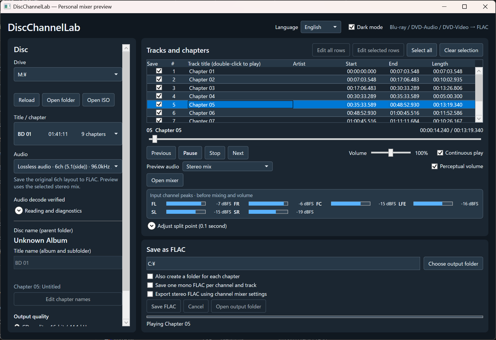
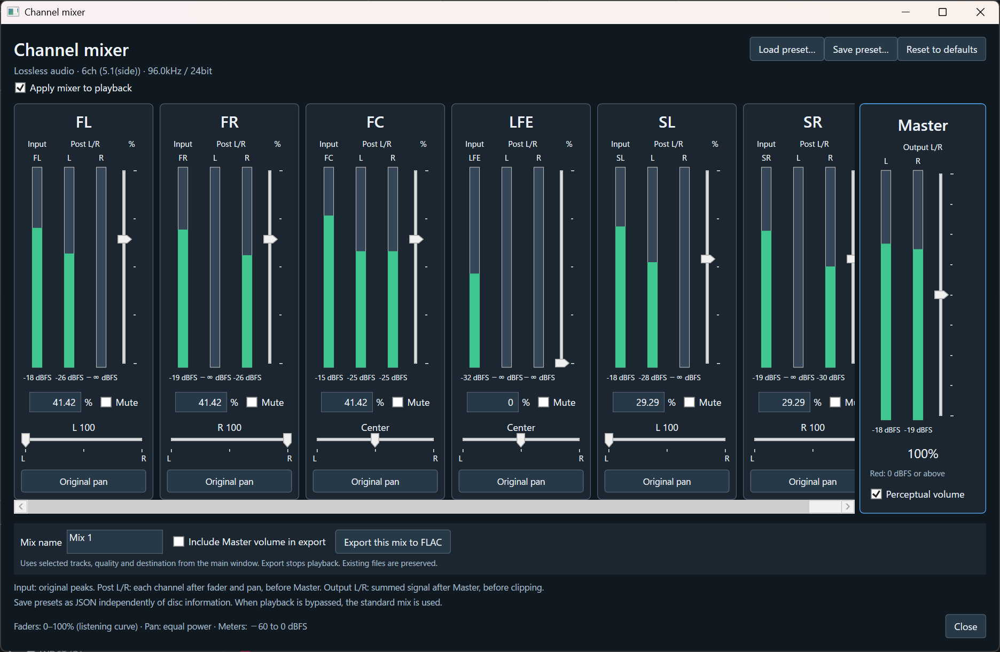
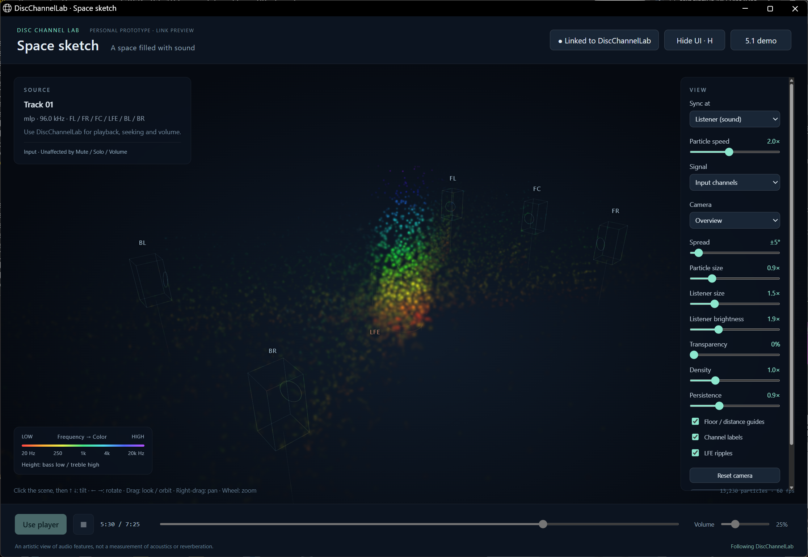
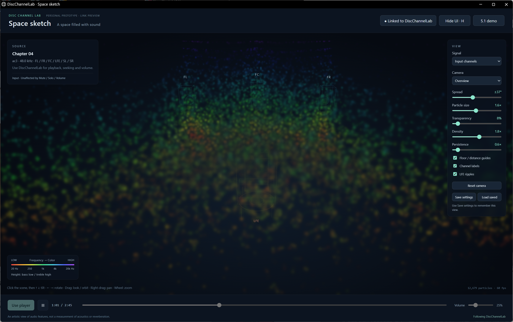
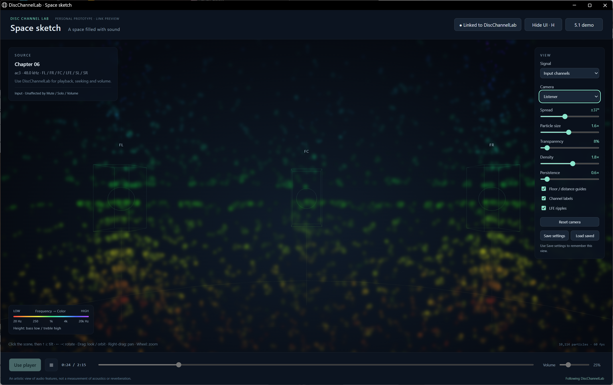

# DiscChannelLab

[日本語](README.ja.md)

DiscChannelLab is a Windows app that helps people explore multichannel audio. Its goal is to make the contents of a 5.1-channel recording, often a black box to nonexperts, easier to inspect and hear. You can listen to one channel at a time, export each channel to its own FLAC file, and compare adjustable stereo mixes.

The app reads supported, unprotected Blu-ray, DVD-Audio, and DVD-Video sources through .NET 10 and FFmpeg. It does not implement copy-protection removal or its own decoder for a branded audio format. It does not claim certification or affiliation with any audio-format owner.

## Screenshots

### Main window



### Channel mixer



Japanese screenshots: [Main window](docs/screenshots/japanese.png) · [Channel mixer](docs/screenshots/mixer-japanese.png)

## 3D visualizer — Space sketch

**The sound you hear becomes light you can see.**

Space sketch lets you follow which channels are active and the directions their sound flows from, through particles colored by frequency. With **Listener (sound)**, particles make their closest approach to the listener at approximately the moment the corresponding audio plays, bringing the channels' overlapping energy into focus.

Bass glows red and orange; treble shines blue and violet. Light gathers with the music, trembles, and flows back into the surrounding space, like sound taking the form of fireflies. We want to open the black box of multichannel audio: hear its details, discover them with your eyes, and enjoy simply watching the music unfold.



*Channel energy across frequency bands, expressed as overlapping light at the listener.*

This companion window follows DiscChannelLab playback and lets you compare Input, Post-mix and final stereo output. It includes camera controls, a distraction-free view and saved JSON settings, with an English UI.





[Usage, mixer behavior and requirements](docs/visualizer.md). Particle spread is an artistic representation, not a precise acoustic simulation.

## Features

- Inspect titles, chapters, tracks, audio streams, and channel layouts.
- Keep available chapters visible when audio is absent, unsupported, or cannot be analyzed. Titles show their inspection state; repeated menu clips are ranked below likely music titles.
- Recover Blu-ray audio by inspecting individual clips when playlist probing fails. Audio IDs are matched across clips even when stream indexes change; streams present in only part of a title are labeled.
- Preview audio with play/pause, previous/next track, seeking, and volume control.
- Recognize AC-3 and E-AC-3 audio on supported, unprotected Blu-ray sources as well as DVD-Video, using the external FFmpeg decoder. These lossy sources can be previewed, mixed, and exported at CD quality; FLAC conversion does not restore information lost in the source encoding.
- Open a separate channel mixer with vertical Input/Post meters, individual faders, numeric gain, Solo, Mute, Ø polarity inversion, and left/right pan. Optional fader links keep left/right pairs at the same gain. Multiple Solo channels can play together; Solo and Mute are mutually exclusive within each channel. Channel gain ranges from 0–100%; Master ranges from 0–200%. Changes update running audio without restarting playback.
- Export the channel mixer to stereo FLAC and save or load reusable JSON presets independently of disc and track metadata. See [Channel mixer](docs/channel-mixer.md).
- Preview volume uses a quadratic low-volume curve by default, with a linear-gain option for analysis. Both keep 100% at unity and 200% at twice the amplitude. Hover over the slider for actual gain and dB; changes ramp over 10 ms.
- See each input channel's peak level during playback, before stereo mixing and volume adjustment. The meters use 20 ms analysis windows and follow the audio player's clock. Hover over a meter to see its peak and RMS values in dBFS.
- Start in dark mode and English by default. Use the **Language** menu for Japanese and the **Dark mode** checkbox for a light theme; both choices are saved for the next launch.
- Select tracks or chapters and adjust split points in 0.1-second steps.
- Export multichannel FLAC, a configurable stereo mix, or one mono FLAC per source channel.
- Edit the disc name, title name, track names, and artists in the table or bulk editor. The title name is saved per disc and title.
- Save FLACs under `<output>/<disc name>/<title name>/<track>.flac`. Each FLAC uses the title name as its `ALBUM` tag and retains the disc name and chapter number in separate tags. Optional chapter folders go beneath the title folder; they are off by default.
- If a playlist extends slightly beyond the audio at a clip's end, conversion may add up to 20 ms of silence to preserve the requested sample count. Larger gaps still fail validation.
- Read saved Blu-ray track, chapter, and album edits from the earlier `Disc2Flac` app when the disc matches.
- Open a disc drive, a disc folder, or a mounted ISO. Protected sources are unsupported.

## A note from Claude Sonnet

> Even without a full 5.1 playback setup, listening to channels individually can reveal sounds that were recorded but have gone unheard.

An AI-generated recommendation supplied by the developer, translated from Japanese. [Read the full text](docs/claude-sonnet-note.md) · [Japanese text](docs/claude-sonnet-note.ja.md).

## Why can a 5.1 stereo mix sound quieter?

The standard mix uses fixed attenuation to leave room for channels being added together. Initial channel-mixer settings and **Reset defaults** now reproduce this same mix for the selected layout. This is a conservative starting point, with no loudness matching to a separate stereo version.

For 5.1 at Master 100%, using `S_L`/`S_R` for the left/right surround channels:

```text
a = 1/sqrt(2) ≈ 0.70710678
D = 1 + 2*a ≈ 2.41421356
L_out = (FL + a*FC + a*S_L) / D
R_out = (FR + a*FC + a*S_R) / D
LFE contribution = 0 by default
```

The relative `1 : 0.7071 : 0.7071` coefficients follow the stereo equations in [ITU-R BS.775-4, Annex 4, Table 2](https://www.itu.int/dms_pubrec/itu-r/rec/bs/R-REC-BS.775-4-202212-I!!PDF-E.pdf). The additional division is this app's fixed headroom policy. The same worst-case scaling rationale is described in the historical [ITU-R BS.1196 (1995), page 88](https://www.itu.int/dms_pubrec/itu-r/rec/bs/R-REC-BS.1196-0-199510-S!!PDF-E.pdf); this is a mathematical reference, not a claim of decoder compliance. [FFmpeg's pan documentation](https://ffmpeg.org/ffmpeg-filters.html#pan-1) also describes normalizing coefficient sums to one.

For normalized input samples with absolute values at most one, the triangle inequality gives `|L_out| <= (1 + a + a)/D = 1`. Thus the sum itself stays within full scale at default settings, even if contributing channels peak together with the same polarity. The scale factor is about `0.41421356`, or `−7.66 dB`, relative to the same unattenuated downmix. Front-only content is reduced by that amount. It is not a prediction of the loudness difference from a separately mastered stereo recording.

The equal-power pan controls express these coefficients as follows:

| 5.1 channel | Default fader | Pan | Contribution to output |
| --- | ---: | --- | --- |
| FL / FR | 41.42% | Left / Right | 0.4142 to its own side |
| FC | 41.42% | Center | 0.2929 to each side |
| Surround L / R | 29.29% | Left / Right | 0.2929 to its own side |
| LFE | 0% | Center | None |

The displayed percentages are rounded; internal coefficients retain precision. Setting FL/FR manually to 100% at their original pan positions still gives unity gain and equal Input/Post peaks. Other layouts use layout-dependent defaults; the five-channel reference above does not establish a universal standard for all 28 supported layouts.

LFE exclusion is an explicit default, not bass management; information present only in LFE is omitted. Channel correlation, phase cancellation, channel levels and differences in the source mixes affect perceived loudness and balance. This app does not interpret a disc's artistic downmix intent or automatically match loudness. Fixed scaling preserves dynamics but can leave unused headroom. A measured peak/loudness adjustment would require a separate analysis step and is not applied automatically.

Increasing faders, adding LFE or raising Master invalidates the default peak bound. Resampling and reconstructed true peaks also lie outside that simple sample-sum proof. There is no automatic limiter. Master is included in FLAC export only when explicitly checked. The playback mixer on/off choice now survives title/disc changes; when it is off, a notice identifies the standard mix, whose gains need not match edited fader positions.

## Reading and diagnostics

The **Reading and diagnostics** panel offers **Retry selected title**, **Inspect all titles**, and **Save diagnostic report**. Initial analysis shows chapter rows before audio probing finishes, then checks remaining titles in the background. Starting playback or another foreground operation stops the background scan. Retry uses longer, bounded probe timeouts. Reports include title states, original/effective chapter boundaries, clip information, errors, and FFmpeg versions; titles not yet inspected are marked accordingly. The report contains disc metadata and local diagnostic details, so review it before sharing.

A short video-only clip at the end of a Blu-ray title is rendered as silence while preserving the original timeline. Eligibility requires a clip of at most two seconds, a unique final occurrence, and an error-free full packet scan of a file no larger than 32 MB confirming video and no audio streams (including unsupported audio). The stream label and diagnostic report identify this treatment. Preview, seeking and FLAC export preserve the tail duration. Uninspected clips, failed probes, missing files, unsupported audio and longer/interior gaps are not silently filled; tracks with unresolved coverage remain unavailable. Standalone video-only titles still show **No audio**.

**Merge short final chapter** includes a final segment shorter than one second in the previous track. Uncheck it to restore the original boundary. The source markers remain intact, and boundary modes retain separate saved track layouts; metadata on matching track starts carries across when toggling. This option does not trim audio.

Audio correspondence uses transport IDs and compatible channel layouts, with unambiguous format/language matching when no ID exists. Ambiguous matches are rejected. Playback and CD export can handle a sample-rate change between matching clips; native high-resolution export requires matching rates and bit depths. A channel-layout change requiring a different interpretation is reported instead of silently changing channels. Short decode checks verify a sample, not every second of a title. Media damage, protected sources, and unsupported formats can still prevent playback.

Developer checks:

```powershell
dotnet run --project DiscChannelLab.Verify -c Release -- reading-tests
dotnet run --project DiscChannelLab.Verify -c Release -- diagnose H:\ diagnostics.json
```

The regression checks generate their own small clips and cover original boundaries, correction/edit persistence, menu ranking, timeouts/cancellation, stream-ID remapping and sample-rate changes, direct-clip fallback, failed-title isolation/retry, no-audio detection, and exact sample counts in cross-clip FLAC exports.

## Requirements

- Windows x64.
- .NET 10 SDK to build; .NET 10 Desktop Runtime to run the public player. The viewer also needs ASP.NET Core Runtime 10 (x64) and Microsoft Edge with WebGL.
- An FFmpeg installation supplied by the user. `ffmpeg.exe` and `ffprobe.exe` are required; `ffplay.exe` is required for preview playback. Place them in a `tools` folder beside the app or make them available on `PATH`.

For supported multichannel stereo playback, Input/Post/Output meters are measured together from PCM in the app. Other playback paths use FFmpeg's `astats` and `ametadata` filters; those meters remain unavailable if the filters are missing.

The FFmpeg build must provide the demuxers, protocols, and decoders needed for your discs. DVD-Audio LPCM requires the `pcm_dvda` decoder; check with `ffmpeg -hide_banner -decoders`. Older builds can misidentify this audio and fail to play it. In particular, FFmpeg's [DVD-Video demuxer](https://ffmpeg.org/ffmpeg-formats.html#dvdvideo) requires GPL library support and `libdvdnav`/`libdvdread`. Consult [FFmpeg's licensing guidance](https://ffmpeg.org/legal.html) for the FFmpeg build you choose. This repository does not contain or download FFmpeg binaries.

## Build

From PowerShell in this directory:

```powershell
./build.ps1
```

The output is in `artifacts/public-win-x64`, with the separate viewer in its `SpaceSketch` subfolder. Click **3D Viewer** in the player to open it. It is a framework-dependent, multi-file application. Run `DiscChannelLab.exe` after installing the .NET 10 Desktop Runtime and making the FFmpeg tools available. The public build does not embed FFmpeg or include a single-file executable.

For personal use, `./build-personal.ps1` builds a self-contained single-file executable from **the same source files**. It embeds the FFmpeg executables installed on the builder's computer. Its output is local and is excluded from this repository; it is not the public distribution build. Before distributing such an executable, review the licenses and corresponding-source obligations of every embedded component.

## Settings and migration

The player stores language (`language.txt`), theme (`theme-v2.txt`) and disc/track edits (`track-edits`) under `%LOCALAPPDATA%\DiscChannelLab`. New logs and the personal build’s extracted tool cache also use this folder; temporary fallbacks use `%TEMP%\DiscChannelLab`.

On startup, existing language/theme files and per-disc JSON metadata are copied from `%LOCALAPPDATA%\BDDVD2Flac` only when the destination file is missing. This preserves disc/title/chapter names, artists, selections, edited split points, both boundary modes and reading options. Current DiscChannelLab files always take precedence. Old files remain unchanged so an earlier build can still read them. Logs and tool caches are not imported; embedded tools are extracted again as needed.

If a copy fails, the app retains read access to legacy settings and retries missing files on a later launch. Older `Disc2Flac` Blu-ray metadata remains readable. Mixer preset files keep their chosen locations, and the separate viewer still stores `ViewerSettings.json` beside its EXE.

A developer regression check uses isolated fixtures rather than the real user profile:

```powershell
dotnet run --project DiscChannelLab.Verify -c Release -- settings-migration-test verification-output/settings-migration
```

## Development and publication status

`DiscChannelLab.App` is the shared application project for both build modes. Feature changes belong there once, so the two builds stay in sync. User settings and saved track edits use `%LOCALAPPDATA%\DiscChannelLab`; startup imports missing settings from the former `BDDVD2Flac` folder without overwriting current edits. See [Settings and migration](#settings-and-migration). The original application source is offered under [Apache License 2.0](LICENSE); external tools remain under their own licenses. This repository is a development preview of the source code, with no binary release. Source-provenance and dependency review remain open before a tagged release. See [PUBLICATION_CHECKLIST.md](PUBLICATION_CHECKLIST.md).
